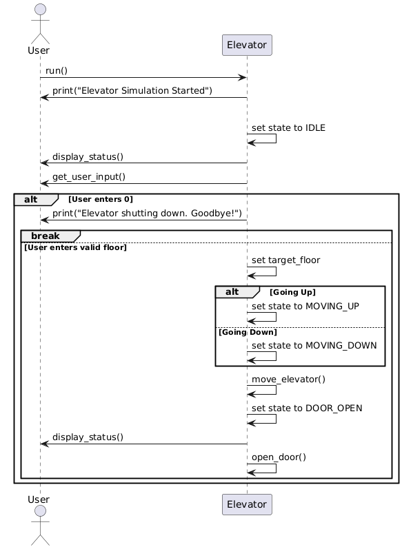

# Elevator Simulation System

## About FMS and DFA

**Finite State Machine (FSM):**  
An FSM is a computational model that can be in exactly one of a finite number of states at any given time. It changes from one state to another in response to external inputs.

**Deterministic Finite Automaton (DFA):**  
A DFA is a type of FSM where for each state and input, there is exactly one transition to a next state. It is used to model systems with predictable behavior.

This elevator system is modeled as an FSM/DFA, where the elevator transitions between states like `IDLE`, `MOVING_UP`, `MOVING_DOWN`, and `DOOR_OPEN` based on user input and current floor.

## Workflow

---

- The diagram above shows the main workflow and state transitions of the elevator system.